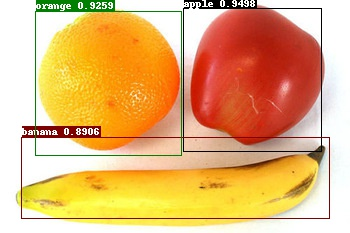

# 基于yolo的水果检测

## 一、介绍
本项目基于深度学习框架paddlepaddle，使用yolov3目标检测算法实现水果检测，橘子、香蕉、苹果图片各80张，检测效果如下图。  


## 二、目录
|-images  存放待检测的图片  
|-output  存放检测好的图片  
|-yolov3_mobilenet_v3_large_voc  存放模型权重文件    

## 三、环境
paddlepaddle>=2.0.0  

## 四、快速使用
1、安装paddle2.0.0以上版本
```bazaar
pip install paddlepaddle
```
2、安装依赖库 
```bazaar
pip install -r requirements.txt
```
3、运行检测，检测结果在output目录中  
```bazaar
python .\infer.py --model_dir=yolov3_mobilenet_v3_large_voc --image_file=images\mixed_6.jpg
```

## 五、其他
目标检测、语义分割模型定制，联系QQ：884001583